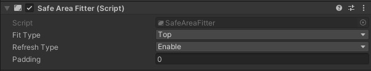

# UGUISafeAreaFitter-Document
"This is a small plugin for adapting UGUI to the safe area on mobile devices. It's very simple to use—just attach it to the GameObject you want to adjust for the safe area. 

You can specify the anchor position using **FitType**, set spacing with **Padding**, and choose between two **RefreshType** modes:

- **Enable**: Adjusts the anchor when the script is enabled.
- **Update**: Adjusts the anchor every frame."

**"If this tool doesn’t meet your expectations, feel free to modify it. Have a great day!"**
